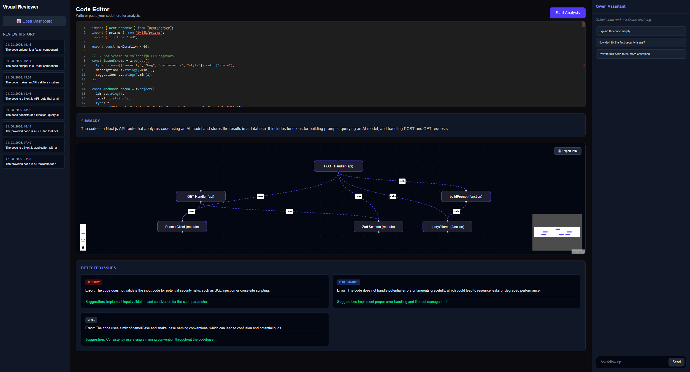
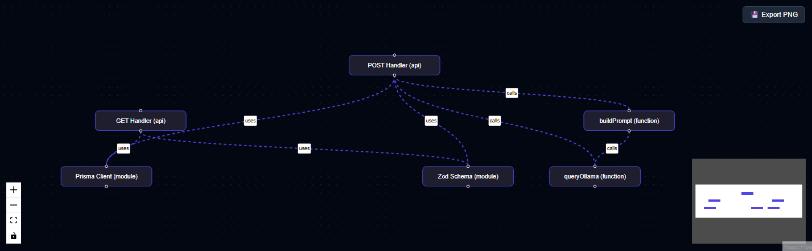
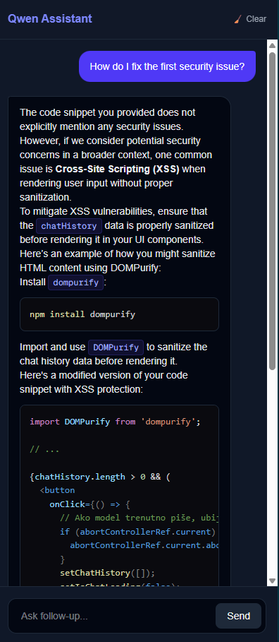
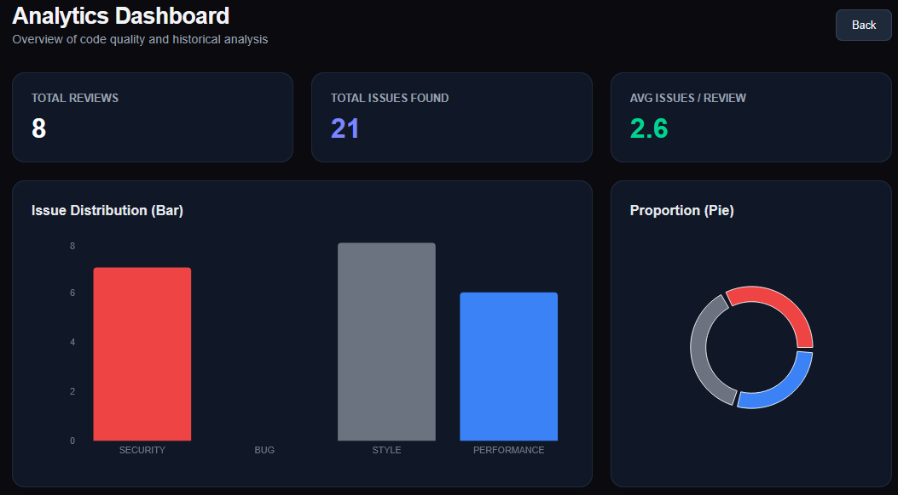

# Visual Code Reviewer - AI-Powered IDE

This is a full-stack, Dockerized web application for static code analysis, built with **Next.js**, **React Flow**, **Prisma**, and **PostgreSQL**. It integrates a local large language model (**Qwen 2.5-Coder** via **Ollama**) to provide real-time architectural visualization, bug detection, and an interactive AI chat assistant.



---

## Tech Stack

- **Framework**: Next.js (React)
- **Language**: TypeScript
- **Styling**: Tailwind CSS
- **Database**: PostgreSQL
- **ORM**: [Prisma](https://www.prisma.io/)
- **AI Engine**: Local Ollama (Qwen 2.5-Coder:7b)
- **Key Libraries**: React Flow (Graph visualization), Monaco Editor (Code editor), Recharts (Dashboard analytics), Zod (Schema validation)
- **DevOps**: Docker & Docker Compose

---

## Core Architecture

### Why Local AI (Ollama)?

Running the Qwen 2.5-Coder model locally via Ollama ensures absolute code privacy, zero API costs, and allows the backend to process potentially sensitive code offline. The backend utilizes Ollama's API with specific parameters (such as `num_predict`, `repeat_penalty`, and strict JSON formatting instructions) alongside an automated retry mechanism to prevent model hallucinations and ensure robust data parsing.

### How is the Architecture Graph Generated?

The application sends the raw code to the AI model with a strict system prompt demanding a structured JSON response. This response is strictly validated on the server using **Zod**. The model extracts functions, components, and dependencies as "nodes" and "edges". This data is then passed to `Dagre` for automatic, collision-free layout calculation, and rendered interactively on the frontend using `React Flow`.

---

## Features

- Interactive **Monaco Code Editor** with TypeScript syntax highlighting and auto-clearing placeholders.



- AI-generated **Architecture Graph** utilizing React Flow and Dagre, with the ability to export diagrams as high-resolution PNG images.
- Advanced Code Review that detects and categorizes issues strictly into: _Security_, _Bug_, _Performance_, and _Style_.



- Integrated **AI Chat Assistant** featuring real-time text streaming, Markdown rendering, syntax highlighting for code blocks, and a one-click copy function.



- **Analytics Dashboard** built with Recharts to visualize code quality trends, issue proportions, and historical analysis data.
- Robust error handling, including AbortControllers to prevent race conditions during chat streaming.
- Fully containerized database and backend environment using Docker Compose.

---

## Getting started

### 1. Clone the repo

```bash
git clone [https://github.com/bjukic2/VisualCodeReviewer.git](https://github.com/bjukic2/VisualCodeReviewer.git)
cd VisualCodeReviewer
```

### 2. Set up Local AI

Make sure you have [Ollama](https://ollama.com/) installed and running on your host machine. Download and initialize the required Qwen model:

```bash
ollama run qwen2.5-coder:7b
```

### 3. Run the application

The Next.js application and the PostgreSQL database are fully containerized. You do not need to manually install Node.js or Postgres. Simply build and start the containers using Docker Compose:

```bash
docker compose up --build
```

> **Note:** Once the build process is complete, the application will be available at `http://localhost:3000`. The Docker container is pre-configured to communicate with the host machine's Ollama instance. The PostgreSQL schema is automatically pushed during the build process.

---

## Author

Made by **Bruno Jukić**  
[https://github.com/bjukic2](https://github.com/bjukic2)
